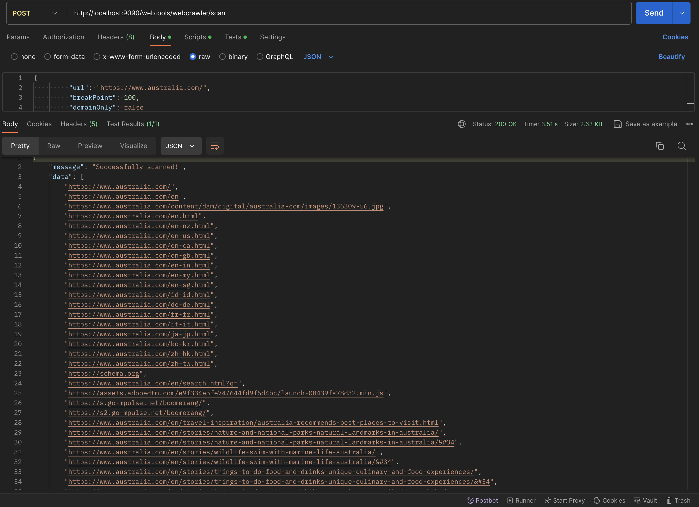
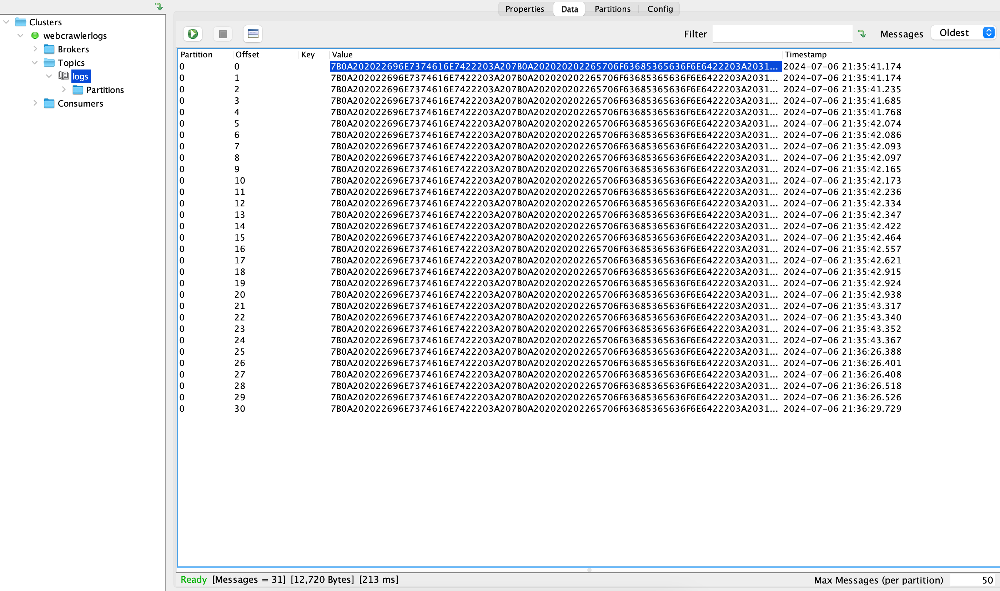
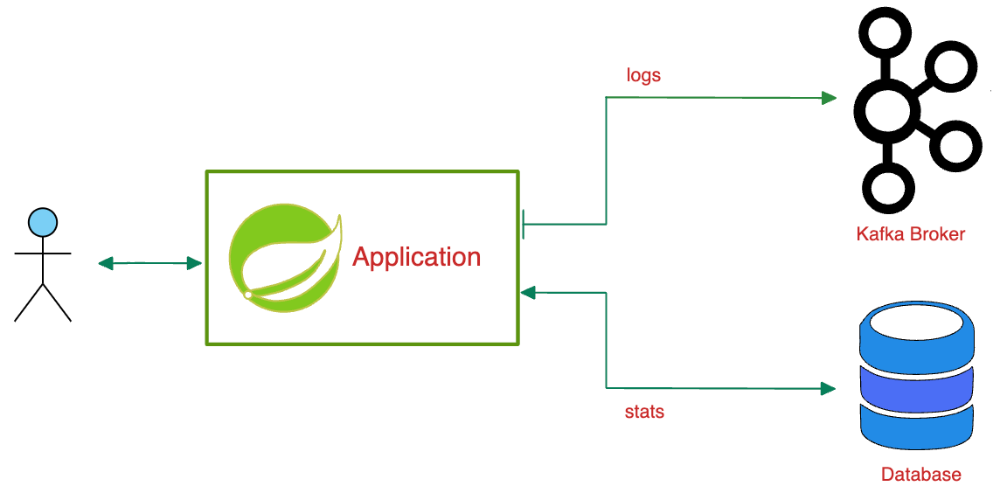

# Project Description
A simple web crawler built with Spring Boot and Kafka.

# Screen Capture

# UseCase

# Deployment
1. Navigate to this docker-compose file and initialize the environment using command:

`docker-compose up -d`

2. Run the application using command:

`mvn spring-boot:run`

3. Build a Docker image from the DockerFile provided:

`mvn clean package`

`docker build -f DockerFile --tag=zatribune-webcrawler:latest`

# Testing

To test the application locally, use this endpoint:

`Method  - POST `
 
`URL  -  http://localhost:9090/webtools/webcrawler/scan	 `

`Body - { "url": "https://www.australia.com/", "breakPoint": 100, "domainOnly": false} `

You can open the KafDrop dashboard and see Kafka cluster log messages via url:

`http://localhost:9000/`

Also, You can open the H2 DB dashboard via url:

`http://localhost:9090/webtools/h2-console`
