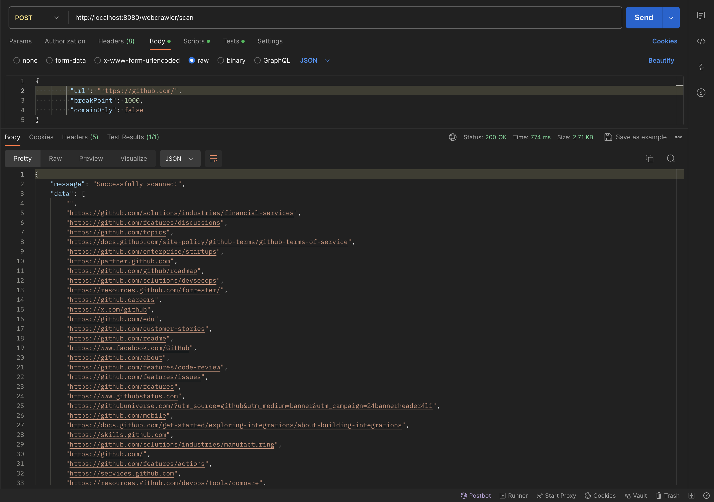

# Description
A simple asynchronous web crawler built in Spring Boot. 

# Feature

1. The crawler is limited to one domain, i.e. when you start with **https://github.com/**, it would crawl all pages within this domain, but not follow external links like Facebook and Twitter links.

2. Given a URL, it will print a simple site map, showing the links between pages.

3. The resulting sitemap is not rendered in a fancy UI (for now), as the focus of this project is the web crawling logic, its structure and behaviour.

# Work-flow:

# Asynchronous Web crawling Process:

## Step 1: Starting the Crawler:

For instance, lets provide **https://github.com/** as our root URL and want to retrieve all links from this website.

## Step 2: Create a HttpClient:
 
 A new **HttpClient** is created using the builder pattern. The executor method of the builder is used to set a custom **Executor** for handling asynchronous tasks. That way the HttpClient uses this executor service to manage its threads for asynchronous tasks, such as sending HTTP requests and receiving responses. This configuration is crucial because the web crawler might need to send multiple HTTP requests concurrently to fetch and process web pages.

## Step 3: Send an Asynchronous HTTP Request:

An asynchronous HTTP GET request is submitted using **HttpClient.sendAsync** to the root URL.

## Step 4: Non-blocking Response Handling:

The response is handled non-blockingly using **thenApply** and **thenAccept**. This allows the crawler to continue processing other tasks while waiting for the response. The web server at **github.com** responds with the HTML content of the homepage. 

## Step 5: Parsing the HTML Content:

**JSoup** Java library is used to parse the HTML content and  extract all the URLs present on the homepage, basically extract all anchor tags.

## Step 6: Continuation and Chaining:

The crawler then sends HTTP requests to each of these URLs and repeats the above steps. The **CompletableFuture** API allows chaining multiple asynchronous operations, making it easier to build complex workflows without blocking.

# Tech Stack:

* Java
* Spring Boot
* Maven

# Screenshots

# Prerequisite

Ensure you have Maven installed. You can verify this by running mvn -v in your terminal.

Ensure you have JDK installed. You can verify this by running java -version in your terminal.

# Testing

1. Navigate to the backend service project directory and run command:

`mvn clean install && mvn spring-boot:run`

2. To test the application locally, you can use POSTMAN or Curl to request this endpoint:

`Method  - POST `
 
`URL  -  http://localhost:8080/webcrawler/scan	 `

`Body - { "url": "https://github.com/", "breakPoint": 100, "domainOnly": false} `
